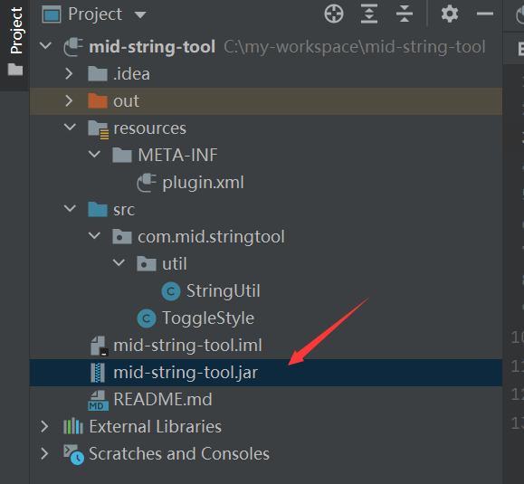
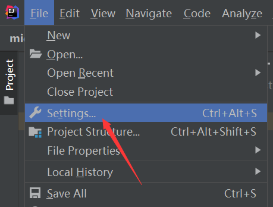
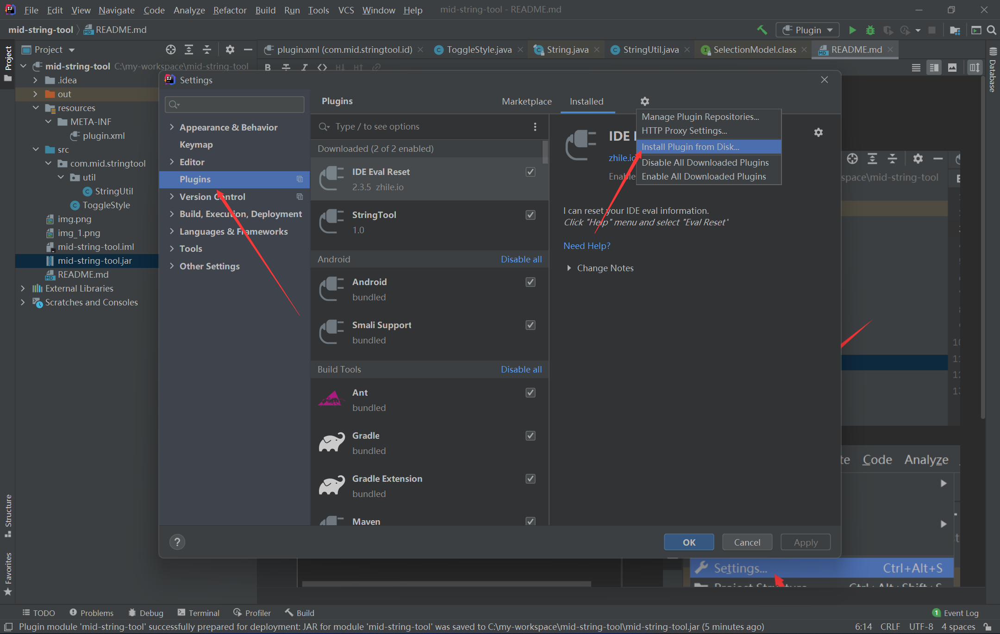
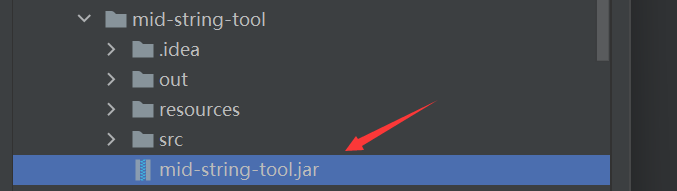
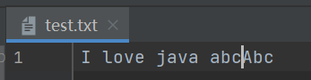
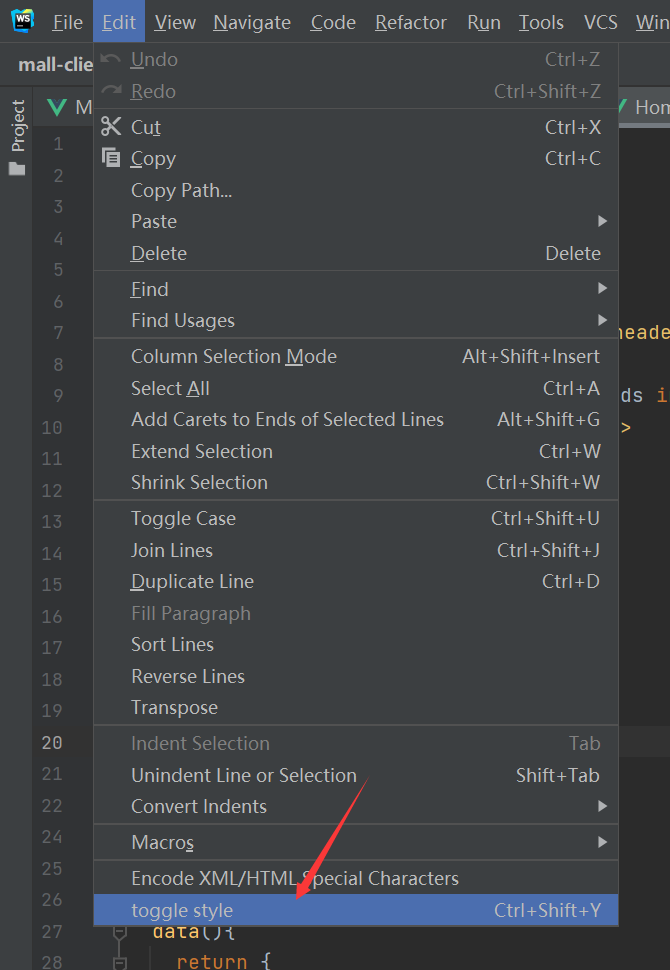
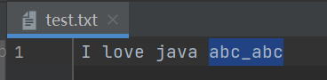

## install

### 1. 找到mid-string-tool.jar

   
### 2. 点击setting

   
### 3. 

4. 

## how to use

### 1. 将光标移动到某个单词

   
### 2. 使用快捷键Ctrl+Shift+y/点击菜单

## todo

判断选中或者没有选中，从而转换

## about selectionModel api

1. getSelectionStart()  // 返回所选文本范围的文档中的起始偏移量
2. getSelectionEnd() // 返回所选文本范围的文档中的结尾便宜量
3. getSelectedText() // 返回光标选中的文本
4. hasSelection() // 检查当前是否选择了文本范围。
5. removeSelection() // 移除选中
6. selectLineAtCaret() //在插入符号位置选择整行文本。